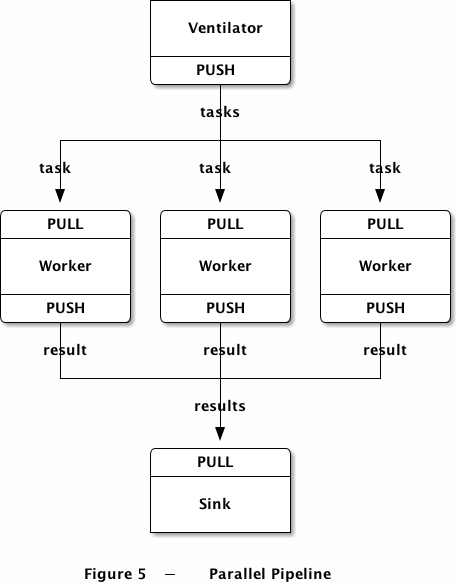
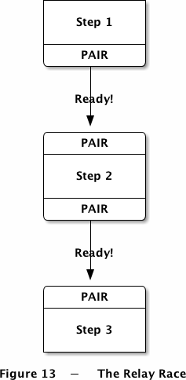

## ZeroMQ-实践

High-performance, asynchronous messaging library

## 一.安装和使用

1.1.安装第三方库：brew install zmq

1.2.CMake引用第三方库：https://blog.csdn.net/u013870094/article/details/78153408

## 二.消息模式

2.1.Request-Reply: 使用REQ-REP套接字发送和接受消息。

2.2.Publish-Subscribe: 单向数据分发，服务端将更新事件发送给一组客户端。

2.3.Parallel Pipeline并行模式

2.4.ZMQ多线程编程

**通信流程：**

- 1.服务端启动一组worker线程，每个worker创建一个REP套接字，并处理收到的请求。
- 2.服务端创建ROUTER套接字用以和client通信
- 3.服务端创建DEALER套接字用以和worker通信。
- 4.服务端启动了QUEUE内部装置，连接两个端点上的套接字。QUEUE装置会将收到的请求分发给连接上的worker，并将应答路由给请求方。

2.5.使用PAIR socket 进行线程间通信

进程内协议，即inproc，可以在同一个进程的不同线程之间进行消息传输。

## 三.参考资料

3.1.ZMQ 中文指南：https://github.com/anjuke/zguide-cn/blob/master/chapter1.md

3.2.ZeroMQ 教程 002 : 高级技巧: https://www.cnblogs.com/neooelric/p/9020872.html
